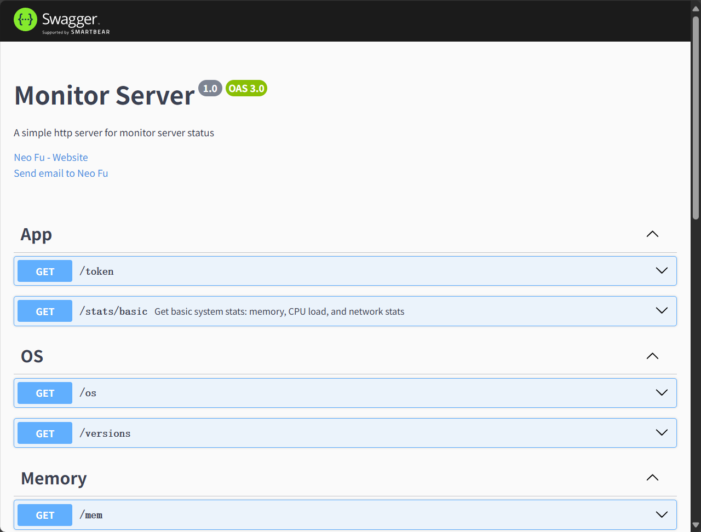

# Monitor Server
## Description

Monitor server is a wrapper for [systeminfonmation](https://systeminformation.io/gettingstarted.html) for NestJS application that provides a REST API for monitoring server status, like CPU usage, memory usage and disk space.

### Start server with pm2

Install pm2 
```shell
npm install -g pm2
```
Clone repo and build
```shell
git clone https://github.com/rtugeek/monitor-server.git
cd monitor-server
# install deps
pnpm install 
# build
pnpm run build
# start with pm2 
pm2 start
```

Customize port and base path in **ecosystem.config.js**
```javascript
module.exports = {
  apps: [{
    name: 'MonitorServer',
    script: './dist/main.js',
    watch: [
      '.',
    ],
    restart_delay: 5000,
    max_restarts: 5,
    autorestart: true,
    env: {
      PORT: 5549,                 👈server port
      BASE_PATH: '/api/monitor',  👈base path
    },
    ignore_watch: [
      'node_modules',
      'pnpm-lock.yaml',
    ],
  }],
}
```
### IMPORTANT!

The **token** must be included in the request header or query parameters; otherwise, the request will fail authentication.

Token is generated when the server starts, you can see it in the console log.

```shell
...
[Nest] LOG [NestApplication] Nest application successfully started +1ms
[Nest] LOG [APP] Server port: 5549
[Nest] LOG [APP] Add the follow token to http request header or search params
[Nest] LOG [APP] ↓↓↓↓↓↓↓↓↓↓↓↓↓↓↓↓↓↓↓↓↓↓↓↓↓↓↓↓↓↓↓↓
[Nest] LOG [APP] sjq2eqcob0irqvs7rm21oxh8zh9zp1ya 👈 token is here
[Nest] LOG [APP] ↑↑↑↑↑↑↑↑↑↑↑↑↑↑↑↑↑↑↑↑↑↑↑↑↑↑↑↑↑↑↑↑
[Nest] LOG [APP] Open http://localhost:5549/api/monitor/doc to see the api doc
```

### Request Example

View Api Doc at http://localhost:5549/api/monitor/doc


```http request
GET http://localhost:5549/api/monitor/os?token=sjq2eqcob0irqvs7rm21oxh8zh9zp1ya
```

### Reset token

```http request
GET http://localhost:5549/api/monitor/token?newToken=your_new_token&token=old_token
```

### Nginx config exmaple

```nginx configuration
location ~ ^/api/monitor/{
    proxy_pass http://localhost:5549; 
    proxy_connect_timeout 300s;
    proxy_send_timeout 900;
    proxy_read_timeout 900;
    proxy_buffer_size 32k;
    proxy_buffers 4 64k;
    proxy_busy_buffers_size 128k;
    proxy_redirect off;
    proxy_hide_header Vary;
    proxy_set_header Accept-Encoding '';
    proxy_set_header Referer $http_referer;
    proxy_set_header Cookie $http_cookie;
    proxy_set_header Host $host;
    proxy_set_header X-Real-IP $remote_addr;
    proxy_set_header X-Forwarded-For $proxy_add_x_forwarded_for;
}
```

### Start server with docker

```bash
docker pull rtugeek/monitor-server
docker run -d -p 5549:5549 rtugeek/monitor-server
```